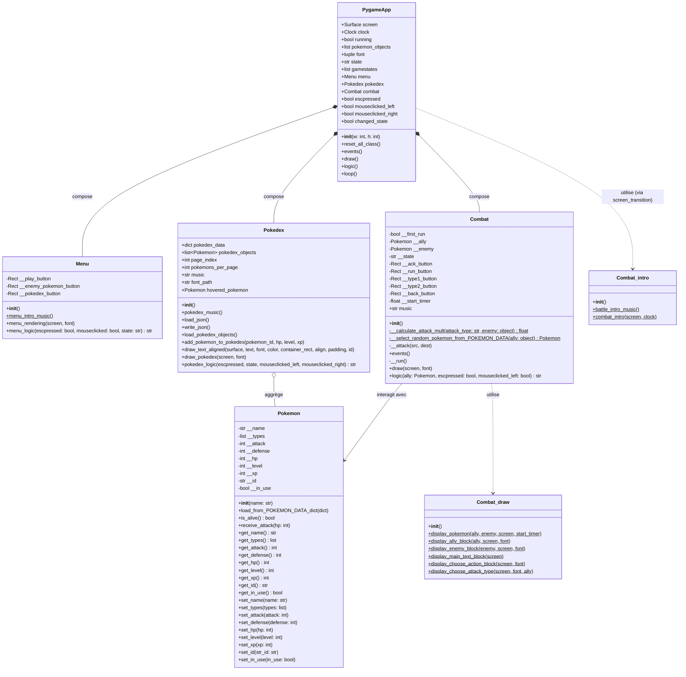

# Pokémon


### Disclaimer

*This project is a school project for educational purposes only. All characters, images, sounds, and trademarks used in this game are the property of Nintendo, Game Freak, and The Pokémon Company.*

*No part of this project is intended for sale or commercial use. It is provided solely for learning and demonstration purposes.*

## Description

This is a recreation of Pokémon's famous combat system, where you battle against other pokémons, in Python and Pygame.

This game includes pokémons from gen 1 and gen 2.


## Controls

- Left mouse click to interact with most things
- In **Pokedex**:
    - Left click to select a pokémon and switch pages (with the arrows)
    - Right click to delete a pokémon
- ESC key to go back

## Installation (Windows only)

Download the latest release of the executable here: https://github.com/nicolas-riera/pokemon/releases/latest

After downloading it, simply run ```Pokemon_[version].exe``` to launch the game.

## Run and Build from source

### Requirements
- Python **3.x**
- pygame -> ```python -m pip install pygame```
- PyInstaller -> ```python -m pip install pyinstaller```

### Run

From the root folder, run :

```bash
python main.py
```

### Build

To build the game (in .exe for Windows, in .app on MacOs, and as a binary file on Linux), use pyinstaller :

```bash
pyinstaller main.py --onefile --noconsole --icon=assets/img/logo.ico --hidden-import=pygame --name "Pokémon" --add-data="assets;assets" --add-data="data;data"
```

On ```--add-data```, replace ";" by ":" if you are on MacOS or Linux.

# Architecture



# Authors

This project has been realised by [Nicolas](https://github.com/nicolas-riera), [André](https://github.com/andrebtw) and [Hugo](https://github.com/hugo-belaloui).
